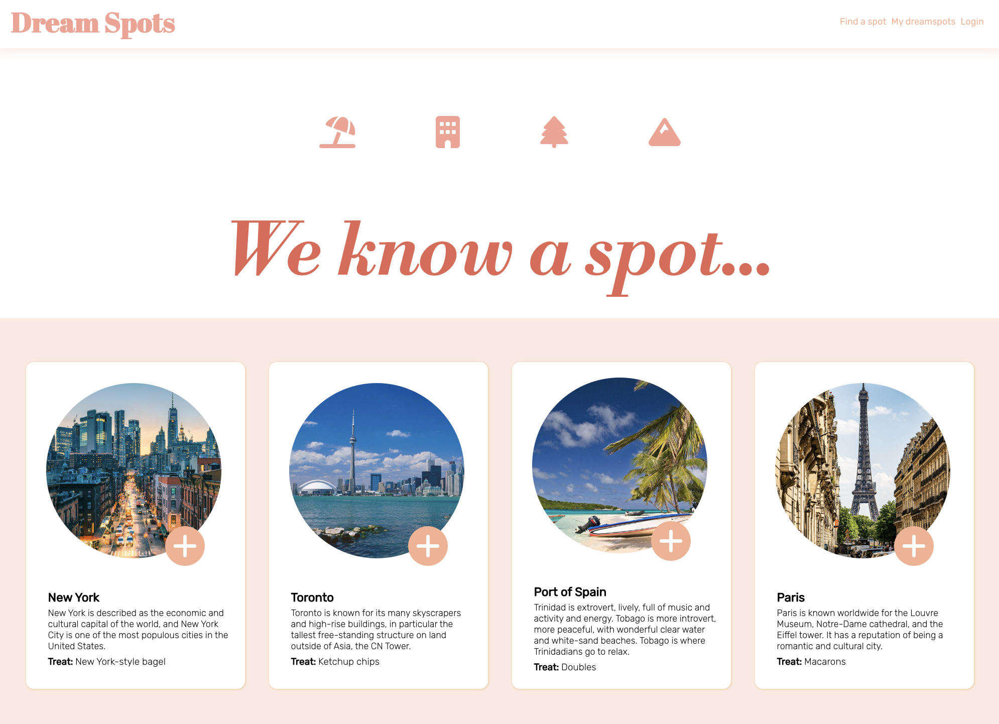

# Dream Spots

  ## Table of Contents
  1. [Description](#description)
  2. [Installation](#installation)
  3. [Usage](#usage)
  4. [License](#license)
  5. [Contributing](#contributing)
  6. [Questions](#questions)

## Description
- The motivation for creating this repository was to create a full-stack application for users to explore and save dream vaction destinations.
- While creating this API, we were able to learn more about the entirety of the MERN stack to connect a front and back end application together for a completely functional user experience.

## Installation
To install the project repository, please follow these steps:
1. Clone my repository to your own on your local device.
2. Navigate into the repository root directory.
3. Enter ```npm install ``` into the command line to get access to all the necessary node modules.

## Usage
To get started using Dreamspots...
1. Navigate to the deployed site at :
2. Start exploring your dream destinations!



## License
This project is not licensed.

## Contributing
This project was created to meet guidelines provided by the University of Toronto School of Continuing Studies Coding Bootcamp. 

If you would like to contribute to this repository, please first discuss the change you wish to make via issue, email, or any other method with the owner of this repository before making a change. Only respectful engagement with this repository will be tolerated to foster an open and welcome environment.

  ### Pull Request Process
  - Pull requests will be merged upon approval from at least two of the repository owners.

## Questions
If you have any questions about this project repository, please feel free to contact its owners.
  #### [katiebutler37](https://github.com/katiebutler37)
  #### [RHunjan](https://github.com/RHunjan)
  #### [neetsabharwal](https://github.com/neetsabharwal)